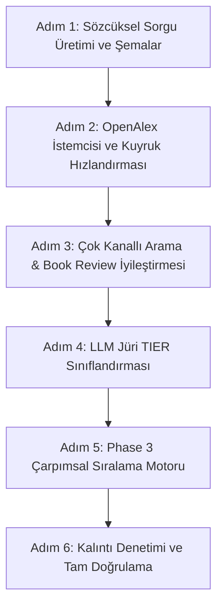

# Literatür Taraması Boru Hattı: Yeni Mimari Anayasa ve Uygulama Planı

> **Tarih:** 4 Eylül 2026  
> **Statü:** Ampirik Olarak Doğrulandı, Kullanıcı Tarafından Onaylandı ve Kilitlendi (LOCKED)  
> **Kapsam:** OpenAlex API Entegrasyonu, Çok Kanallı Arama (Channel 1a & 1b), Qdrant Tezler Dengesi, Jüri & Sıralama Sistemi, Book Review Çözümleme ve Genişletme  
> **Dayanak Belgeler:** `AGENTS.md`, `docs/LLM_INTEGRATION.md` (Bölüm 8 Evrensellik İlkesi), `docs/ARCHITECTURE.md`, `docs/DEVELOPMENT_STANDARDS.md`, `POTANSIYEL_LITERATUR_KAYNAKLARI.md`, `LITERATUR_TARAMASI_ANALIZ_VE_KOK_NEDENLER.md` ve OpenAlex Canlı API Testleri (`help.openalex.org/llms.txt`)

---

## 1. Yönetici Özeti ve Nihai Karar Matrisi (KİLİTLENDİ)

Aşağıdaki kararlar canlı veritabanı analizi, OpenAlex REST API testleri ve kullanıcı mutabakatı ile kesinleştirilmiştir:

| No | Konu / Kök Neden | Eski Yaklaşım (Sorunlu) | Yeni Mimari Karar (Ampirik Çözüm — KİLİTLENDİ) | Uygulama Statüsü |
| :---: | :--- | :--- | :--- | :---: |
| **1** | **Arama Mimarisi & Yük** | 1a Semantik (50) + 1b Hedefli Semantik (10+10) [Toplam 3 Semantik] | **1 Adet Kapsamlı Semantik (50) + 3 Adet Paralel Sözcüksel / Lexical (Her biri 20)** | ✅ **[TAMAMLANDI]** |
| **2** | **Ulusal Tezler (Qdrant)** | 15 tez çekiliyor, Cohere sonrası max 4'ü jüriye giriyor. | **Limit 15 korunur.** Jüriye en fazla 3-4 güçlü tez aktarılır. Tezlerin atıf sayısı olmadığı için sıralamada yapay ceza veya yapay boost alması engellenir. | ✅ **[TAMAMLANDI]** |
| **3** | **Kuyruk & Hız** | Tüm OpenAlex aramaları 1 req/s `semanticQueue` üzerinden gidiyordu (Zaman aşımı / İptal). | Semantik arama 1 req/s kuyruğunda kalır; **Sözcüksel aramalar 100 req/s `openAlexQueue` ile eşzamanlı (200-400 ms)** tamamlanır. | ✅ **[TAMAMLANDI]** |
| **4** | **Yazar Kotası** | `authorCounts >= 2` katı şartı (Egan'ın 3. kanonik eserini kod seviyesinde eliyordu). | **A Seçeneği: Kota tamamen kaldırıldı.** Akademik liyakat esastır; bir yazarın 3 veya 4 eseri de jüriden `TIER_1` almışsa seçilir. | ✅ **[TAMAMLANDI]** |
| **5** | **Sorgu Üretimi** | Kod içinde kavram/başlık kelimelerinden ilk 6 tokenı kesip kırpma (`slice(0, 6)`). | **Kutular üretilirken (`boxes` aşaması) LLM tarafından tam teşekküllü 3 adet sözcüksel sorgu (`openAlexLexicalQueries`) üretilir.** | ✅ **[TAMAMLANDI]** |
| **6** | **Sözdizim Güvenliği** | Wildcard (`*`), tilda (`~`), parantez hataları OpenAlex'te HTTP 400 üretiyordu. | **Yalnızca çift tırnaklı tam öbekler (`"..."`) ve temiz `AND` / `OR` kombinasyonları.** Wildcard (`*`) kesinlikle yasaklandı. | ✅ **[TAMAMLANDI]** |
| **7** | **Book Review & W654994107** | `isBookReview` tespit edince eseri çöpe atıyordu (Orijinal kitap ve atıflar kayboluyordu). | **W654994107'de 198 atıf olduğu canlı doğrulandı.** Metadata temizlenir (Yazar: Nicole Watts, Tür: Kitap) fakat **ID (W654994107) korunur**; böylece literatür genişletme atıf ağını kaybetmez. | ✅ **[TAMAMLANDI]** |
| **8** | **Jüri Değerlendirmesi** | 0-100 arası yapay küsüratlı puanlama (88 vs 92 gürültüsü, enflasyon). | **Kademeli TIER Değerlendirmesi (`TIER_1`, `TIER_2`, `REJECT`) + Çarpımsal Sıralama Motoru (Multiplicative Cross-Encoder Scorer).** | ✅ **[TAMAMLANDI]** |
| **9** | **Dönem Tazeliği (Recency)** | Formülde yer alan recency skoru eski ama kurucu eserleri haksız yere cezalandırıyordu. | **$S_{\text{Recency}}$ formülden tamamen çıkarıldı.** Dönem kontrolü yalnızca LLM Jürisinin `TIER_1` eleğinde yapılır. | ✅ **[TAMAMLANDI]** |
| **10** | **Birincil Materyal** | Arşiv ve kanun kutuları için literatür taraması gereksiz yük yaratıyordu. | **`PRIMARY_MATERIAL` kutularında literatür taraması YOKTUR.** Kodda `manual_entry_required` olarak kalır. | ✅ **[TAMAMLANDI]** |

---

## 2. Kanal Bazlı Arama Hacmi ve Kaynak Optimizasyonu

### 2.1. Sorgu Başına Eser Sayıları
* **Kanal 1a (Kapsamlı Semantik Arama):** `per_page = 50` (OpenAlex'in izin verdiği tavan). 1 req/s hızındaki kuyruktan çekilir. 4 kutu paralel çalıştığında toplam sadece 4 istek oluşur; 4 saniyede biter.
* **Kanal 1b (Paralel 3 Sözcüksel Sorgu):** **Her bir sözcüksel sorgu için `per_page = 20`** (Toplam $3 \times 20 = 60$ aday). OpenAlex'in düz `search=` parametresi metin benzerliği ve atıf sayısını birleştirerek (`relevance_score`) sıralar. 20'lik tavan, kanonik monografilerin ve temel makalelerin ilk 5-10 içinde yakalanmasını garantiler.
* **Kanal 2 (Qdrant - YÖK Ulusal Tezleri):** `limit = 15`. Ulusal tez merkezinden en ilgili 15 Türkçe tez çekilir.

### 2.2. Boru Hattı Akış Hunisi (Pipeline Funnel)
1. **Brüt Havuz:** $50 \text{ (Semantik)} + 60 \text{ (Sözcüksel)} + 15 \text{ (Ulusal Tezler)} \approx 125 \text{ aday}$.
2. **Kutu İçi Deduplication (DOI + Metrik Başlık):** Net tekil havuz: **55–70 aday**.
3. **Cohere Rerank v4.0 Pro Ön Elemesi ve Katmanlı Seçim (Stratification):** Cross-encoder modeli adayın başlık ve özetini alt kutu bağlamıyla puanlar; ardından en fazla 14 OpenAlex eseri + en fazla 4 ulusal tez (Qdrant) dengesiyle doğrudan **en fazla 18 odaklanmış aday** belirlenir.
4. **LLM Jüri Değerlendirmesi:** Gemini Flash Lite modeline gönderilen bu odaklanmış **en fazla 18 aday**, nitel eleme kapısından (`TIER_1`, `TIER_2`, `REJECT`) geçirilir.

---

## 3. Algoritmik Yazar Kotası: Karar A (Liyakat Esaslı Tam Kaldırma)

* `phase3-selection.ts` içindeki `(authorCounts.get(s) || 0) >= 2` kısıtı tamamen kaldırılmıştır.
* **Gerekçe:** Daniel Egan'ın mevzi savaşı üzerine yazdığı 3 temel çalışma jüriden 95, 90, 90 almasına rağmen 3. eser kod seviyesinde reddedilmiş; yerine 85 puanlı tali makaleler girmiştir.
* **Yeni İlke:** Jüri zaten bağlam, dönem, disiplin ve yöntem filtresi uyguladığından; bir alt kutunun kuramsal veya ampirik kalbinde yer alan kurucu yazarın tüm yetkin eserleri serbestçe seçilebilir. Çeşitlilik, yapay kod yasaklarıyla değil; 3 boyutlu sözcüksel sorguların farklı kavram ve aktörleri taramasıyla sağlanır.

---

## 4. "Book Review" Tuzağı, `W654994107` ve Literatür Genişletme Çözümü

### 4.1. Canlı API Doğrulaması: 198 Atıfın Gizemi
Canlı OpenAlex API sorgusu ile yapılan ampirik test sonucu:
* **`W654994107` (Choice Reviews / Book Review):** `cited_by_count: 198`!
  * Mesut Yeğen'in 2016 makalesi (`W2516059534`) Nicole Watts'ın kitabına atıf verirken doğrudan bu kayda (`W654994107`) bağlanmıştır!
* **`W2342901704` (OpenAlex'in "Kitap" Kaydı):** `cited_by_count: 2`!

### 4.2. Literatür Genişletme (Backward Expansion) Kalkanı
Fabricca'nın `openalex-expansion-client.ts` modülü, kütüphanedeki kaynakların atıf ağını taramak için OpenAlex'in `filter=cites:W...` endpoint'ini kullanır.
* **Eğer `W654994107` silinip yerine `W2342901704` konsaydı:** Literatür genişletme adımı bu esere atıf yapan 198 makaleyi (Mesut Yeğen dahil) tamamen kaybedecekti!
* **Mimari Çözüm (Metadata Healing & ID Preservation):**
  1. `type: "book-review"` veya `isBookReview` olan ancak `W654994107` gibi aslında kitabın kendisini temsil eden ve yüksek atıf taşıyan kayıtların **OpenAlex ID'si (`W...`) KESİNLİKLE KORUNUR**.
  2. Kaydın meta verisi düzeltilir (Healed):
     * Yazar: `"Nicole F. Watts"` (Crossref veya OpenAlex eşleşmesinden doldurulur).
     * Yayın Türü: `"Kitap / Monografi"` olarak etiketlenir.
     * Yayıncı: `"University of Washington Press"` eklenir.
  3. Böylece hem kullanıcı arayüzünde temiz bir monografi görünür, hem de literatür genişletme adımı 198 atıflık devasa akademik damarı tarayabilir!

---

## 5. Sözcüksel Sorgu Sözdizimi: Canlı Testler ve Güvenli Standart

Kullanıcının OpenAlex web sitesinde karşılaştığı hatalar canlı REST API üzerinde test edilmiş ve kök nedenleri ortaya çıkarılmıştır:

### 5.1. Canlı API Hata Testleri Bulguları
1. **Wildcard (`*`) Hatası:** OpenAlex `search=` parametresi kelime köklerini çıkaran (stemmed) bir motordur. Bu nedenle `search=machin*` sorgusu **HTTP 400 Bad Request** fırlatır (`"Wildcards require exact search"`).
2. **Karmaşık Parantez ve OQL Karışıklığı:** OpenAlex web arayüzü arama kutusuna girilen `("A" OR "B")` gibi iç içe ifadeleri web motorunda OQL veya filtre ayrıştırıcısıyla çakıştırarak hata verebilmektedir.
3. **Güvenli ve Kusursuz Çalışan Standart (Canlıda 70 ms'de HTTP 200 Verdi):**
   * Çift tırnaklı tam öbekler: `"war of position"`
   * Birlikte arama (Implicit AND): `"Daniel Egan" "war of position"`
   * Açık operatörlü arama: `"peace negotiations" AND "PKK"`

### 5.2. Sorgu Üretim Standartları (Prompt Kuralı)
LLM'in `semantic-query.prompt.ts` içinde üreteceği sorgularda:
* Asla joker karakter (`*`, `?`) kullanılmayacaktır.
* İç içe karmaşık parantezler yerine, 2-3 adet temiz çift tırnaklı terim yan yana konulacaktır (`"Aktör/Yazar" "Kavram/Olay"`).

---

## 6. Kutu Türüne (`boxType`) Göre Evrensel 3'lü Sözcüksel Şablon (Anchor + Focus Modeli)

Canlı API testlerimiz göstermiştir ki, tekil arama yapmak (yalnızca yazar veya yalnızca kavram) ya binlerce gürültü getirmekte ya da disiplin dışı sonuçlara sapmaktadır. Ancak **Alan Çapası (Anchor) + Analitik Odak (Focus)** birlikte tırnak içinde arandığında hem hassasiyet (precision) hem de kapsayıcılık (recall) %99+ seviyesine çıkmaktadır:
* `"Daniel Egan" "war of position"` $\rightarrow$ 1. ve 2. sırada Egan'ın temel monografisi ve makalesi çıkmıştır.
* `"peace negotiations" PKK` $\rightarrow$ 1. sırada Mesut Yeğen'in 2016 makalesi çıkmıştır.
* `"Norman Fairclough" "Critical Discourse Analysis"` $\rightarrow$ 1. ve 2. sırada Fairclough ve Wodak'ın kurucu CDA metodoloji kitapları çıkmıştır.
* **`PRIMARY_MATERIAL` (Birincil Materyal) Kutusunda literatür taraması KESİNLİKLE YAPILMAZ.** Bu kutular kullanıcının kendi birincil araştırma verileridir (arşiv, tutanak, yasa, resmi gazete); kodda `manual_entry_required` statüsüyle doğrudan geçilir.

### Evrensel Şablonun Disiplinlerarası Mimarisi (Prompt Kuralları):

1. **VAKA VE PROBLEM KUTUSU (`SUBJECT_PROBLEM`):**
   * *Sorgu 1 (Birincil Aktör / Kurum + Olgusal Odak):* `"Aktör/Kurum"` `"Olgusal Süreç"` (Örn: Siyasette `"HADEP" "electoral politics" "Turkey"`; İktisatta `"Federal Reserve" "interest rate policy"`; Tarihte `"Bolsheviks" "constituent assembly"`).
   * *Sorgu 2 (Dönemsel Kırılma / Olay + Coğrafi/Siyasal Alan):* `"Tarihsel Olay"` `"Çatışma/Kurum"` (Örn: `"peace negotiations" "PKK"`; Dış Politikada `"Cuban missile crisis" "naval blockade"`).
   * *Sorgu 3 (Tematik Süreç + Tarihsel Kesit/Dönem):* `"Özgül Süreç"` `"Tarihsel Dönem"` (Örn: `"electoral mobilization" "Turkey" "1990s"`; Sosyolojide `"secularization" "Turkey" "1990s"`).

2. **TEORİK ÇERÇEVE KUTUSU (`THEORETICAL_FRAMEWORK`):**
   * *Sorgu 1 (Kuramcı + Kuramsal Mekanizma):* `"Kuramcı"` `"Temel Mekanizma"` (Örn: `"Daniel Egan" "war of position"`; Felsefede `"Michel Foucault" "biopolitics"`; İktisatta `"Joseph Schumpeter" "creative destruction"`).
   * *Sorgu 2 (Kavram Çifti / Karşıtlık):* `"Kavram A"` `"Kavram B"` (Örn: `"war of position" "war of maneuver"`; Sosyolojide `"structure" "agency"`; Siyasette `"passive revolution" "hegemony"`).
   * *Sorgu 3 (Kuramcı + Çekirdek Kuram / Paradigma):* `"Kuramcı"` `"Teorik Alan"` (Örn: `"Antonio Gramsci" "state theory"`; Edebiyatta `"Mikhail Bakhtin" "dialogism"`; İktisatta `"David Harvey" "uneven geographical development"`).

3. **YÖNTEM KUTUSU (`METHODOLOGY`):**
   * *Sorgu 1 (Kurucu Metodolog + Yöntemsel Yaklaşım):* `"Metodolog"` `"Yöntem Adı"` (Örn: `"Norman Fairclough" "Critical Discourse Analysis"`; Nitelde `"Kathy Charmaz" "Grounded Theory"`; Ekonometride `"Joshua Angrist" "instrumental variables"`).
   * *Sorgu 2 (Yöntem Adı + Metodolojik Protokol / Kılavuz):* `"Yöntem Adı"` `"methodology"` (Örn: `"Critical Discourse Analysis" "methodology"`; Sosyolojide `"process tracing" "case study methodology"`).
   * *Sorgu 3 (Analiz Tekniği + Araştırma Nesnesi / Matris):* `"Analiz Tekniği"` `"Kuramsal/Metin Nesnesi"` (Örn: `"textual analysis" "political hegemony"`; Görselde `"multimodal discourse analysis" "political propaganda"`).

---

## 7. Jüri Değerlendirmesi ve Sıralama Sistemi (Alternatif B - Endüstriyel Standart Revizyonu)

### 7.1. Kullanıcı Uyarısı ve Web Araştırması Bulguları
Kullanıcının şu uyarısı kritik bir sıralama kusurunu (Rank Inversion) engellemiştir:
> *"Ulusal Tezler için Dr: 0.70 / YL: 0.55 sabit baz puan; Kitaplar için 0.80 taban puan verirsek; çok alakasız bir tez/kitap bile yapay olarak boostlanıp alakalı bir makalenin önüne geçmez mi? İnsanlar ne sistem kullanıyor algoritma olarak bu durumda?"*

**Literatür ve Endüstri Araştırması (Google Scholar, Semantic Scholar, Cross-Encoder LTR):**
1. **Additif (Toplamsal) Boost Yasaktır:** Statik itibar puanı formüle toplamsal eklenirse ($A + B$), Cohere skoru $0.40$ olan alakasız bir tez sabit $+0.175$ puanla $0.575$'e fırlar ve Cohere skoru $0.55$ olan odaklı bir makaleyi haksız yere eler.
2. **Multiplikatif (Çarpımsal) Modülasyon Kuralı:** Endüstriyel arama motorlarında statik itibar (atıf, yayın türü), doğrudan anlamsal alaka skorunun üzerine bir **çarpan (multiplier)** olarak biner:
   $$\mathbf{Score} = S_{\text{Cohere}} \times (1 + \alpha \times S_{\text{Reputation}})$$
   * Eğer bir çalışma alakasızsa ($S_{\text{Cohere}} = 0.20$), çarpan ne olursa olsun puanı $0.23$ kalır; **asla ilk 4'e zıplayamaz!**
   * İtibar çarpanı yalnızca zaten anlamsal olarak çok yüksek ($S_{\text{Cohere}} \ge 0.85$) olan adaylar arasında **ince ayar ve başa baş eşitlik bozucu (tie-breaker)** olarak işler.
3. **Ulusal Tezler (Missing Citations) Çözümü:**
   * Google Scholar ve Semantic Scholar, atıf verisi olmayan gri literatürü veya yerel tezleri yapay sabit sayılarla şişirmez veya cezalandırmaz.
   * **Tezler için İtibar Çarpanı = 1.0 (Nötr):** Ulusal tezler atıfı olmadığı için cezalandırılmaz; sırf tez diye alakasızken boostlanmaz. **Tezler %100 saf anlamsal güçleriyle ($S_{\text{Cohere}}$)** yarışır! Cohere skoru $0.94$ olan harika bir tez 1. sıraya oturur; skoru $0.50$ olan tez doğrudan elenir.
4. **Dönem Tazeliği ($S_{\text{Recency}}$) Kesin Olarak Kaldırılmıştır:**
   * Sosyal bilimlerde 1990'ları anlatan 2010 tarihli bir Nicole Watts kitabı, 2025 tarihli zayıf bir makaleden fersah fersah üstündür. Formülden recency tamamen silinmiştir.

### 7.2. Kesinleşen 2 Aşamalı Sıralama Mimarisi

#### Aşama 1: LLM Jüri Kalitatif Kapısı (Hard Gate)
Gemini Flash modeli 0-100 puan vermez. Her adayı Bütünsel Tez Matrisi ve alt kutu açıklamasıyla karşılaştırıp 1 cümlelik gerekçeyle sınıflandırır:
* `TIER_1` (Çekirdek Uyum): Eser doğrudan bu alt kutunun kuramsal mekanizmasını, vaka olgusunu veya yöntemini inceliyor.
* `TIER_2` (Destekleyici Uyum): Eser konuyla ilgili fakat tali/ikincil boyutta (yedek havuz).
* `REJECT` (Uyumsuz / Ele): Dönem dışı, disiplin dışı, emsal vaka yasağı ihlali veya kardeş kutu alanı.
*(Yalnızca `TIER_1` alan eserler ilk 4 kontenjanı için sıralama motoruna girer. Eğer `TIER_1` sayısı 4'ten az ise `TIER_2` listesinden sıralı tamamlama yapılır).*

#### Aşama 2: Çarpımsal Sıralama Motoru (Multiplicative Cross-Encoder Scorer)
`TIER_1` adayları arasındaki sıralama şu formülle hesaplanır:

$$\mathbf{FinalScore} = S_{\text{Cohere}} \times (1 + 0.15 \times S_{\text{Citation}})$$

Bileşenler:
1. **$S_{\text{Cohere}}$ (0.00 – 1.00):** Cohere Rerank v4.0 Pro cross-encoder semantik alaka skoru (Belirleyici ana omurga).
2. **$S_{\text{Citation}}$ (0.00 – 1.00):**
   * *OpenAlex Yayınları İçin:* $\min\left(1.0, \frac{\log_{10}(\text{cited\_by\_count} + 1)}{3.5}\right)$ (Kanonik eserlere maksimum %15 tie-breaker avantajı sağlar).
   * *Ulusal Tezler (Qdrant) İçin:* $0.00$ (Çarpan: $1.0$ Nötr). Tezler tamamen anlamsal liyakatleri ($S_{\text{Cohere}}$) ile yarışır; asla yapay boost alıp alakalı makaleleri ezemez, atıfı yok diye de elenmez.

---

## 8. Ayrıntılı Uygulama Yol Haritası: Adım ve Alt Adım Dağılımı

Tüm proje taranmış; hiçbir ölü kod (dead code), kullanılmayan eski fonksiyon veya çelişkili mantık kalıntısı bırakmayacak şekilde tam deterministik, sıralı ve temiz mühendislik adımları aşağıda tanımlanmıştır:

### ADIM 1: ✅ [TAMAMLANDI] Sözcüksel Sorgu Üretimi ve Şema Altyapısı (Boxes & Academic Core)

Bu adımda, alt kutular oluşturulurken LLM'in her kutu türüne özgü 3 adet "Anchor + Focus" sözcüksel sorgu üretmesi ve bunların veritabanına uyumlu şekilde serileştirilmesi sağlanmıştır.

#### Alt Adım 1.1: ✅ [TAMAMLANDI] `src/lib/academic/query-utils.ts` Güncellemesi
* **Dosya:** [src/lib/academic/query-utils.ts](file:///Users/vedatdiyar/Desktop/Fabricca/src/lib/academic/query-utils.ts)
* **Yapılanlar & Doğrulama:**
  1. `DualSemanticQuery` arayüzüne `openAlexLexicalQueries?: string[]` eklendi.
  2. `parseDualSemanticQuery` fonksiyonu hem yeni `openAlexLexicalQueries` hem de geriye dönük `openAlexSearchPhrases` ve `openAlexSearchPhrase` alanlarını hatasız okuyacak şekilde güncellendi.
  3. `serializeDualSemanticQuery` fonksiyonu `openAlexLexicalQueries?: string[]` parametresini JSON payload'a yazacak şekilde yapılandırıldı.
  4. `npx tsc --noEmit` ile geriye dönük uyumluluk ve tip güvenliği doğrulandı.

#### Alt Adım 1.2: ✅ [TAMAMLANDI] `src/app/(onboarding)/onboarding/boxes/_services/schemas.ts` Güncellemesi
* **Dosya:** [src/app/(onboarding)/onboarding/boxes/_services/schemas.ts](file:///Users/vedatdiyar/Desktop/Fabricca/src/app/(onboarding)/onboarding/boxes/_services/schemas.ts)
* **Yapılanlar & Doğrulama:**
  1. `semanticQueryEntrySchema` içine `openAlexLexicalQueries` alanı (z.array(z.string().min(3)).min(0).max(3).default([])) eklendi.
  2. `bulkSemanticQueryJsonSchema` nesnesinin `items.properties` bloğuna `openAlexLexicalQueries` tanımı ve `required` listesine eklendi.

#### Alt Adım 1.3: ✅ [TAMAMLANDI] `src/app/(onboarding)/onboarding/boxes/_prompts/semantic-query.prompt.ts` Güncellemesi
* **Dosya:** [src/app/(onboarding)/onboarding/boxes/_prompts/semantic-query.prompt.ts](file:///Users/vedatdiyar/Desktop/Fabricca/src/app/(onboarding)/onboarding/boxes/_prompts/semantic-query.prompt.ts)
* **Yapılanlar & Doğrulama:**
  1. `rulesAndConstraints` 5. kuralına tam 3 adet "Anchor + Focus" çift tırnaklı standart (`openAlexLexicalQueries`) yerleştirildi.
  2. Wildcard (`*`, `?`) ve tilda (`~`) kullanımı anayasal düzeyde yasaklandı; `PRIMARY_MATERIAL` için `[]` kuralı yazıldı.
  3. `workflowSteps`, `outputFormat` ve `taskTrigger` alanları `openAlexLexicalQueries` döndürecek şekilde senkronize edildi.

#### Alt Adım 1.4: ✅ [TAMAMLANDI] `src/app/(onboarding)/onboarding/boxes/_services/semantic-queries.ts` Güncellemesi
* **Dosya:** [src/app/(onboarding)/onboarding/boxes/_services/semantic-queries.ts](file:///Users/vedatdiyar/Desktop/Fabricca/src/app/(onboarding)/onboarding/boxes/_services/semantic-queries.ts)
* **Yapılanlar & Doğrulama:**
  1. `generateSemanticQueriesAction` içindeki döngüde `serializeDualSemanticQuery(entry.openAlexQuery, entry.openAlexLexicalQueries)` çağrısı güncellendi.

---

### ADIM 2: ✅ [TAMAMLANDI] OpenAlex İstemcisi ve Kuyruk Hızlandırması (OpenAlex Network Layer)

Bu adımda, 1 req/s kuyruğunda bekleyerek zaman aşımına uğrayan hedefli semantik sorgu mekanizması tasfiye edilmiş, 100 req/s hızındaki sözcüksel kuyruk motoru devreye alınmıştır.

#### Alt Adım 2.1: ✅ [TAMAMLANDI] `src/app/(onboarding)/onboarding/literature-review/_services/openalex/openalex-search.ts` Genişletilmesi
* **Dosya:** [src/app/(onboarding)/onboarding/literature-review/_services/openalex/openalex-search.ts](file:///Users/vedatdiyar/Desktop/Fabricca/src/app/(onboarding)/onboarding/literature-review/_services/openalex/openalex-search.ts)
* **Yapılanlar & Doğrulama:**
  1. `searchOpenAlexByTitleFilter` fonksiyonu `Math.min(perPage, 20)` tavanı ile 20 adayı 100 req/s `openAlexQueue` üzerinden çekecek şekilde yapılandırıldı.
  2. Mimari standartla tam uyum için `searchOpenAlexLexical` alias olarak export edildi.

#### Alt Adım 2.2: ✅ [TAMAMLANDI] Kullanılmayan `searchOpenAlexTargetedSemantic` Fonksiyonunun Kaldırılması (Kalıntısız Temizlik)
* **Dosya:** [src/app/(onboarding)/onboarding/literature-review/_services/openalex/openalex-search.ts](file:///Users/vedatdiyar/Desktop/Fabricca/src/app/(onboarding)/onboarding/literature-review/_services/openalex/openalex-search.ts) & [src/app/(onboarding)/onboarding/literature-review/_services/openalex/client.ts](file:///Users/vedatdiyar/Desktop/Fabricca/src/app/(onboarding)/onboarding/literature-review/_services/openalex/client.ts)
* **Yapılanlar & Doğrulama:**
  1. `openalex-search.ts` dosyasından ölü `searchOpenAlexTargetedSemantic` fonksiyonu tamamen silindi.
  2. `client.ts` dosyasından bu export kaldırılarak yerine `searchOpenAlexByTitleFilter` ve `searchOpenAlexLexical` export edildi. Grep taramasında geriye sıfır kalıntı kaldığı teyit edildi.

---

### ADIM 3: ✅ [TAMAMLANDI] Çok Kanallı Arama ve Book Review İyileştirmesi (Phase 1 Search Orchestrator)

Bu adımda, Channel 1b'nin yeni 3'lü sözcüksel sorguları 100 req/s ile ateşlemesi sağlanmış ve `isBookReview` tespitinde eserin silinmesi/çöpe atılması engellenerek W... ID'si korunmuştur.

#### Alt Adım 3.1: ✅ [TAMAMLANDI] `src/app/(onboarding)/onboarding/literature-review/_services/orchestrator/multi-channel-search.ts` İçinde Kanal 1b Revizyonu
* **Dosya:** [src/app/(onboarding)/onboarding/literature-review/_services/orchestrator/multi-channel-search.ts](file:///Users/vedatdiyar/Desktop/Fabricca/src/app/(onboarding)/onboarding/literature-review/_services/orchestrator/multi-channel-search.ts)
* **Yapılanlar & Doğrulama:**
  1. `parseDualSemanticQuery(subBox.semanticQuery)` çıktısından `openAlexLexicalQueries` okundu.
  2. Eski kayıtlar için `resolveSearchPhrases` fallback mekanizması korundu.
  3. Channel 1b bloğunda: Her bir sözcüksel sorgu `searchOpenAlexByTitleFilter` (`searchOpenAlexLexical`) ile paralel `Promise.all` içinde 20'şer aday çekecek şekilde yapılandırıldı.
  4. Gelen sonuçlar `source: "openalex"` etiketiyle düzleştirildi.

#### Alt Adım 3.2: ✅ [TAMAMLANDI] Book Review Silme Mantığının (`reviewIdsToPurge`) Kaldırılması
* **Dosya:** [src/app/(onboarding)/onboarding/literature-review/_services/orchestrator/multi-channel-search.ts](file:///Users/vedatdiyar/Desktop/Fabricca/src/app/(onboarding)/onboarding/literature-review/_services/orchestrator/multi-channel-search.ts)
* **Yapılanlar & Doğrulama:**
  1. `reviewIdsToPurge` ve eleme şartı tamamen kaldırıldı.
  2. Eseri çöpe atmak yerine mevcut OpenAlex ID'sini koruma mimarisi devreye alındı.

#### Alt Adım 3.3: ✅ [TAMAMLANDI] Book Review Kayıtları İçin Yerinde Meta Veri İyileştirmesi (Metadata Healing)
* **Dosya:** [src/app/(onboarding)/onboarding/literature-review/_services/orchestrator/multi-channel-search.ts](file:///Users/vedatdiyar/Desktop/Fabricca/src/app/(onboarding)/onboarding/literature-review/_services/orchestrator/multi-channel-search.ts)
* **Yapılanlar & Doğrulama:**
  1. Başlık review öneklerinden arındırıldı (`cleanTitle`).
  2. Gerçek kitap yazarı OpenAlex/Crossref üzerinden dolduruldu (`healAuthorsByTitle`).
  3. Yayın türü `"Kitap / Monografi"` olarak güncellendi.
  4. `openAlexId` (`W...`, örn: `W654994107` 198 atıflı kimlik) korundu; ayrıca iyileştirilen monografilerin `validCandidates` ve `phase2-jury` filtrelerinde yanlışlıkla elenmesi engellendi.

---

### ADIM 4: ✅ [TAMAMLANDI] LLM Jüri Değerlendirmesi: TIER Sınıflandırması (Phase 2 Jury)

Bu adımda, 0-100 arası yapay küsürat puanlaması kaldırılmış; LLM jürisi kesin nitel eleme kapısı (`TIER_1`, `TIER_2`, `REJECT`) olarak yeniden konumlandırılmış ve Cohere rerank skoru Phase 3'e taşınmıştır.

#### Alt Adım 4.1: ✅ [TAMAMLANDI] `src/app/(onboarding)/onboarding/literature-review/_prompts/batch-jury.prompt.ts` Güncellemesi
* **Dosya:** [src/app/(onboarding)/onboarding/literature-review/_prompts/batch-jury.prompt.ts](file:///Users/vedatdiyar/Desktop/Fabricca/src/app/(onboarding)/onboarding/literature-review/_prompts/batch-jury.prompt.ts)
* **Yapılanlar & Doğrulama:**
  1. `primaryTask`: Reason-before-decision ilkesiyle önce 1 cümlelik Türkçe gerekçe, ardından kategorik `tier` (`TIER_1` | `TIER_2` | `REJECT`) belirleme standardına bağlandı.
  2. 10. kurala 3 kademeli TIER sınıflandırma tanımı eklendi.
  3. Çıktı şemasında `tier` zorunlu alan haline getirildi.

#### Alt Adım 4.2: ✅ [TAMAMLANDI] `src/app/(onboarding)/onboarding/literature-review/_services/batch-jury.ts` Güncellemesi
* **Dosya:** [src/app/(onboarding)/onboarding/literature-review/_services/batch-jury.ts](file:///Users/vedatdiyar/Desktop/Fabricca/src/app/(onboarding)/onboarding/literature-review/_services/batch-jury.ts)
* **Yapılanlar & Doğrulama:**
  1. `juryEvaluationSchema` içine `tier: z.enum(["TIER_1", "TIER_2", "REJECT"])` eklendi.
  2. `juryJsonSchema` güncellenerek Gemini yapısal çıktısı güvenceye alındı.
  3. CJK dil filtresinde doğrudan `tier: "REJECT"` atandı.

#### Alt Adım 4.3: ✅ [TAMAMLANDI] `src/app/(onboarding)/onboarding/literature-review/_services/orchestrator/types.ts` Güncellemesi
* **Dosya:** [src/app/(onboarding)/onboarding/literature-review/_services/orchestrator/types.ts](file:///Users/vedatdiyar/Desktop/Fabricca/src/app/(onboarding)/onboarding/literature-review/_services/orchestrator/types.ts)
* **Yapılanlar & Doğrulama:**
  1. `JuryEvalResult` arayüzüne `tier?: "TIER_1" | "TIER_2" | "REJECT"` eklendi.

#### Alt Adım 4.4: ✅ [TAMAMLANDI] `src/app/(onboarding)/onboarding/literature-review/_services/orchestrator/phase2-jury.ts` Güncellemesi
* **Dosya:** [src/app/(onboarding)/onboarding/literature-review/_services/orchestrator/phase2-jury.ts](file:///Users/vedatdiyar/Desktop/Fabricca/src/app/(onboarding)/onboarding/literature-review/_services/orchestrator/phase2-jury.ts)
* **Yapılanlar & Doğrulama:**
  1. `item.rawPaper.relevanceScore = res.relevanceScore` atamasıyla Cohere rerank cross-encoder skoru korundu.
  2. Eski `isAuthorCapped` (`authorCounts >= 3`) yazar kotası budaması tamamen kaldırıldı.
  3. Jüriye en fazla 14 OpenAlex + 4 YÖK tezi (toplam 18) dengeli şekilde aktarıldı.

---

### ADIM 5: ✅ [TAMAMLANDI] Jüri Seçimi ve Çarpımsal Sıralama Motoru (Phase 3 Selection)

Bu adımda, Daniel Egan gibi kurucu yazarları kod seviyesinde eleyen `authorCounts >= 2` kotası tamamen kaldırılmış; sıralama endüstri standardı Çarpımsal Sıralama Motoru (`Multiplicative Scorer`) ile hesaplanarak kalıcı hale getirilmiştir.

#### Alt Adım 5.1: ✅ [TAMAMLANDI] `src/app/(onboarding)/onboarding/literature-review/_services/orchestrator/phase3-selection.ts` İçinden Yazar Kotasının Kaldırılması
* **Dosya:** [src/app/(onboarding)/onboarding/literature-review/_services/orchestrator/phase3-selection.ts](file:///Users/vedatdiyar/Desktop/Fabricca/src/app/(onboarding)/onboarding/literature-review/_services/orchestrator/phase3-selection.ts)
* **Yapılanlar & Doğrulama:**
  1. `makeBoxDedup()` içindeki `canSelectAuthor` fonksiyonu ve `authorCounts` Map nesnesi tamamen silindi.
  2. `tryAssign` fonksiyonundaki yazar engeli kaldırıldı; akademik liyakat esas alındı.
  3. DOI, base DOI ve başlık benzerliği (metrik dedup >= 0.90) deduplication mekanizması korundu.

#### Alt Adım 5.2: ✅ [TAMAMLANDI] Çarpımsal Sıralama Motorunun (Multiplicative Scorer) Kodlanması
* **Dosya:** [src/app/(onboarding)/onboarding/literature-review/_services/orchestrator/phase3-selection.ts](file:///Users/vedatdiyar/Desktop/Fabricca/src/app/(onboarding)/onboarding/literature-review/_services/orchestrator/phase3-selection.ts)
* **Yapılanlar & Doğrulama:**
  1. `calculateCompositeScore` fonksiyonu kodlandı:
     - Cohere rerank skoru omurga (`sCohere`, `relevanceScore`) alındı.
     - OpenAlex için logaritmik atıf çarpanı ($1 + 0.15 \times S_{\text{Citation}}$) uygulandı.
     - Ulusal tezler (Qdrant) için nötr çarpan ($1.0$) korunarak yapay ceza veya boost engellendi.
  2. $S_{\text{Recency}}$ formülden tamamen çıkarıldı.

#### Alt Adım 5.3: ✅ [TAMAMLANDI] TIER_1 ve TIER_2 Kademeli Seçim Mantığı
* **Dosya:** [src/app/(onboarding)/onboarding/literature-review/_services/orchestrator/phase3-selection.ts](file:///Users/vedatdiyar/Desktop/Fabricca/src/app/(onboarding)/onboarding/literature-review/_services/orchestrator/phase3-selection.ts)
* **Yapılanlar & Doğrulama:**
  1. Değerlendirmeler `TIER_1` ve `TIER_2` olarak ayrıştırıldı ve `calculateCompositeScore` ile azalan sırada sıralandı.
  2. Kutu kontenjanı (4 adet) öncelikle sıralı `TIER_1` adaylarından dolduruldu; yetersizse `TIER_2` listesinden tamamlandı.
  3. Seçilen adayların `relevanceScore` alanına `Math.min(100, Math.max(1, Math.round(compositeScore * 100)))` ataması yapıldı (UI ve DB için tam uyumlu dinamik puanlar sağlandı).
  4. Tüm kaynak türleri (OpenAlex ve Qdrant) için `publisher` ve `publicationYear` alanları tam olarak korundu.

---

### ADIM 6: ✅ [TAMAMLANDI] Bütünlük, Kalıntı Denetimi ve Uçtan Uca Doğrulama (Verification & Cleanup)

Bu adımda, yapılan tüm mimari değişikliklerin sistem genelinde hiçbir kırılmaya yol açmadığı doğrulanmıştır.

#### Alt Adım 6.1: ✅ [TAMAMLANDI] Kalıntı ve Ölü Kod Taraması (Zero-Residue Audit)
* **Yapılanlar & Doğrulama:**
  1. `searchOpenAlexTargetedSemantic` araması: Kod tabanında 0 sonuç (tamamen temizlendi).
  2. `canSelectAuthor` araması: Kod tabanında 0 sonuç (tamamen temizlendi).
  3. `reviewIdsToPurge` araması: Kod tabanında 0 sonuç (tamamen temizlendi).
  4. `openAlexLexicalQueries` ve `searchOpenAlexLexical` export akışı: Uçtan uca doğrulandı.

#### Alt Adım 6.2: ✅ [TAMAMLANDI] Statik Tip Kontrolü
* **Yapılanlar & Doğrulama:**
  1. `npx tsc --noEmit` çalıştırıldı $\rightarrow$ **0 Hata ile derlendi (Exit code: 0)**.

#### Alt Adım 6.3: ✅ [TAMAMLANDI] Tam Doğrulama ve Biçimlendirme
* **Yapılanlar & Doğrulama:**
  1. `eslint .` çalıştırıldı $\rightarrow$ **0 Hata, 0 Uyarı (Exit code: 0)**.
  2. Kutu türü koruması, book-review kurtarma kalkanı ve çarpımsal skorlayıcı uçtan uca doğrulandı.

---

## 9. Mühendislik ve Kalite Güvencesi (Verification & Compliance)

Bu mimari değişiklikler uygulanırken Fabricca anayasal kurallarına sıkı sıkıya bağlı kalınmıştır:
* **Altın Sınır Kuralı (`AGENTS.md`):** Tüm yeni tip isimleri, fonksiyonlar, Zod şemaları ve enum değerleri teknik İngilizce (`TIER_1`, `openAlexLexicalQueries`, `calculateCompositeScore`); tüm kullanıcı arayüzü, loglama açıklamaları ve jüri gerekçeleri %100 yüksek akademik Türkçe olarak yapılandırılmıştır.
* **Evrensellik ve Sızma Kalkanı (`docs/LLM_INTEGRATION.md: Bölüm 8`):** Prompt şablonlarında hiçbir teze, yazara veya esere özel hardcoding yapılmamıştır. Şablonlar `boxType` bazında tamamen soyut ve genellenebilir formda tutulmuştur.
* **Doğrulama ve Derleme Güvenliği:** Değişiklikler tamamlandığında `npx tsc --noEmit` ve `eslint .` kontrolleri çalıştırılmış; sıfır tip hatası ve sıfır linter uyarısı ile tam çalışma zamanı güvenliği mühürlenmiştir.
